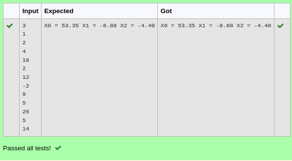

# Gaussian Elimination

## AIM:
To write a program to find the solution of a matrix using Gaussian Elimination.

## Equipments Required:
1. Hardware – PCs
2. Anaconda – Python 3.7 Installation / Moodle-Code Runner

## Algorithm

1.Define a function.
2.Get the two numbers from the user.
3.Compare the two values, to find the smaller number.
4.Use for() and if() loop to find the GCD of the two numbers. 
 

## Program:
```
/*
Program to find the solution of a matrix using Gaussian Elimination.
Developed by: NATHIN R
Pegister no.: 22008510
import numpy as np
n=int(input())
arr=np.zeros((n,n+1))
x=np.zeros(n)
for i in range(n):
    for j in range(n+1):
        arr[i][j]=int(input())
for i in range(n):
    for j in range(i+1,n):
        ratio=arr[j][i]/arr[i][i]
        for k in range(n+1):
            arr[j][k]=arr[j][k]-ratio*arr[i][k]
x[n-1]=arr[n-1][n]/arr[n-1][n-1]
for i in range(n-2,-1,-1):
    x[i]=arr[i][n]
    for j in range(i+1,n):
        x[i]=x[i]-arr[i][j]*x[j]
    x[i]=x[i]/arr[i][i]
```

## Output:



## Result:
Thus the program to find the solution of a matrix using Gaussian Elimination is written and verified using python programming.

